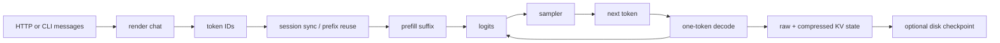
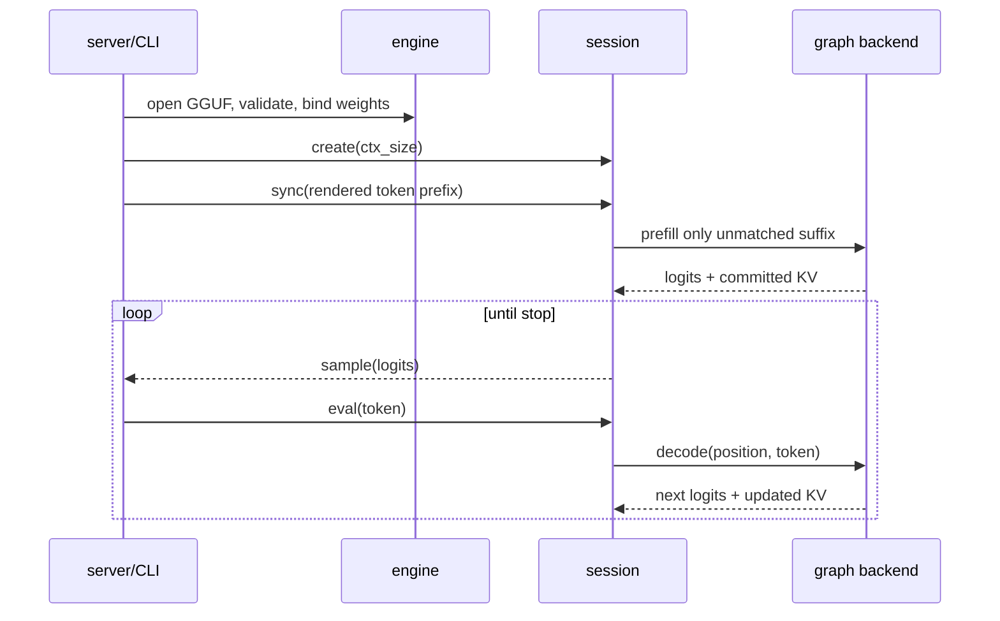

# 2. From prompt text to persistent state

[Previous](01-foundations.md) · [Index](README.md) · [Next](03-deepseek-v4.md)

This chapter follows one request without skipping ownership transitions.

## 1. Open and validate the model

`ds4_engine_create_with_gpu_config` enters `ds4_engine_open_internal`, which
calls `model_open`, `config_validate_model`, then `weights_bind` before backend
initialization. The loader parses/memory-maps GGUF; validation selects only a
known `ds4_shape`, checks mandatory metadata and tensor layouts, and rejects
arbitrary GGUFs. See [engine open](https://github.com/antirez/ds4/blob/c1d4597a80e300b803dc642519718f2c999589da/ds4.c#L57400),
[`model_open`](https://github.com/antirez/ds4/blob/c1d4597a80e300b803dc642519718f2c999589da/ds4.c#L2452), and
[`ds4_select_shape_from_metadata`](https://github.com/antirez/ds4/blob/c1d4597a80e300b803dc642519718f2c999589da/ds4.c#L5470).

## 2. Render and tokenize

The public chat helpers are `ds4_chat_begin`, `ds4_chat_append_message`, and
`ds4_chat_append_assistant_prefix`; `ds4_tokenize_rendered_chat` performs the
vocabulary encoding. Server code maps OpenAI/Anthropic messages and tool calls
before these helpers. Prompt templates are semantics: changing control tokens
can change quality even when kernels are identical.

## 3. Create and synchronize a session

`ds4_session_create` allocates CPU reference cache/scratch or a backend graph,
logits, sampling probabilities, and checkpoint token storage. Session sync finds
the common prefix with `checkpoint`, preserves reusable KV rows, and evaluates
only the suffix. For a fresh prompt, `metal_graph_prefill_chunked` or
`metal_graph_prefill_raw_swa` executes it; the CPU oracle uses
`prefill_layer_major_cpu`. The final prompt row produces `[129280]` F32 logits.

## 4. Sample and decode

`ds4_session_sample` delegates to greedy argmax at temperature zero or the
top-k/top-p/min-p probability path. The chosen integer token is passed to
`ds4_session_eval`; `ds4_session_eval_internal` executes one position, updates
raw/compressed attention state, writes new logits, and appends the committed
token to the checkpoint. The server’s generation loop is anchored at
[`ds4_session_eval` / `ds4_session_sample`](https://github.com/antirez/ds4/blob/c1d4597a80e300b803dc642519718f2c999589da/ds4_server.c#L11015).

## 5. Persist

`ds4_session_save_payload` serializes a versioned header, token checkpoint,
logits, per-layer compressed-row counts, logical raw-ring rows, compressed rows,
and compressor partial-window state. `ds4_session_load_payload` validates model
layout and capacity before restoring. Saving only token IDs would require replay;
saving rows without partial compressor state would make the next compressed row
wrong. See [payload save/load](https://github.com/antirez/ds4/blob/c1d4597a80e300b803dc642519718f2c999589da/ds4.c#L51400).

## Check and experiment

Trace `"hello"` by setting breakpoints on the symbols above. Expected: rendering
precedes vocabulary lookup; prefill emits logits for the final prompt token; the
sample is evaluated before it becomes part of the reusable checkpoint. Change
one early prompt token. Expected: reuse ends at the first mismatch.

