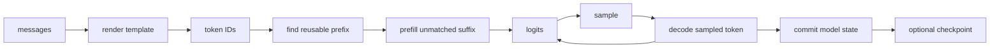

# 2. One complete DwarfStar request

[Previous](01-foundations.md) · [Index](README.md) · [Next](03-deepseek-v4.md)

## Why this matters

A request crosses template, model, state, sampling, and persistence boundaries.
DwarfStar makes those transitions concrete if its DeepSeek assumptions are
kept visibly separate.

## Trace and annotations



1. `ds4_engine_open_internal` opens, validates a known shape, binds exact tensor
   names, and initializes a backend. **Reuse:** validate before kernels. **Discard:**
   DwarfStar shapes and names.
2. `ds4_chat_*` renders and `ds4_tokenize_rendered_chat` encodes. **Reuse:**
   template bytes are semantics. **Adapt:** pin Qwen tokenizer and policy.
3. `ds4_session_create` owns logits, scratch, and prefix state. Sync compares
   token IDs and prefills only the suffix. **Reuse:** lifetime and prefix policy.
   **Discard:** raw/compressed cache layout.
4. `ds4_session_sample` selects logits; `ds4_session_eval` evaluates the token
   and only then appends it to the checkpoint. **Reuse unchanged:** commit order.
5. `ds4_session_save_payload` saves all hidden cache components. **Adapt:** save
   Qwen GDN matrices/rings, ordinary KV, and positions.

For a prompt of `P` tokens, the first call accepts `[1,P,5120]`; only the final
`[248320]` logit row need survive. Each decode call accepts `[1,1,5120]`, updates
all 64 layers, and emits the next logits.

## Concrete Qwen engine work

```text
Engine(ModelSpec, ModelWeights, BackendOps)
Session(SequenceInput prefix, SessionState, sampler state)
sync(ids): longest common token prefix -> restore/replay -> prefill suffix
step(token): embed -> forward(position) -> logits -> atomic state/token commit
```

Store model, tokenizer, template, quant, and state-format hashes in checkpoints.

## Common failures

- Appending a sample before evaluating it.
- Matching source strings rather than rendered token IDs.
- Saving tokens but silently replaying missing state.
- Saving attention KV while losing GDN state.
- Treating DwarfStar measurements as Qwen estimates.

## Exercise and expected result

Trace a two-turn request, then change one early token. Expected: reuse ends at
the first differing ID, only the suffix prefills, and a sampled token becomes
reusable after all hybrid state commits.

