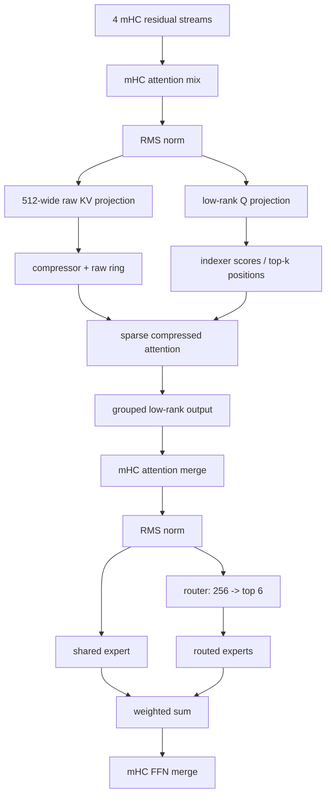

# 3. One DeepSeek V4 layer

[Previous](02-execution-path.md) · [Index](README.md) · [Next](04-numerics.md)

Separate reusable principles from DwarfStar invariants.

## Layer dataflow

`metal_graph_encode_decode_layer_phase` is the per-layer graph orchestration
hub, reached by `metal_graph_eval_token_raw_swa`; the readable CPU
counterparts are `forward_token_raw_swa_cpu`, attention helpers, and
`layer_ffn_shared_batch`. Backend wrappers dispatch into `ds4_cuda.cu` or Metal
kernels while retaining fallback paths. Search by symbol at the pinned commit,
not by assuming the graph is Metal-only despite historical names.

## Attention state

**DwarfStar invariant.** Flash layers 0–1 have compression ratio 0. Thereafter
even layers use 4 and odd layers 128; `validate_compress_ratio_metadata` rejects
a mismatch. The raw ring stores recent 512-wide F32 rows. Compressed rows are
append-only; partial-window KV and score states must survive across calls.
Ratio-4 layers also maintain 128-wide indexer-compressed rows. The indexer has
64 heads and selects up to 512 positions. These constants are validated, not
tuning defaults.

**Reusable principle.** Keep an exact recent window and summarize older state;
use a learned/derived selector to spend compute on relevant history. Correctness
depends on update order, position mapping, partial-window carry, and matching
the training-time compression rule.

Approximate F32 payload per completed compressed attention row is `512*4 =
2,048 B`; ratio 128 amortizes that to 16 B/source-token/layer, ignoring raw
window and state. Ratio 4 amortizes to 512 B/source-token/layer plus its index
rows. This is **Estimated**, useful for intuition only; use
`ds4_context_memory_estimate` for the complete implementation budget.

## mHC and experts

mHC carries four residual streams. Learned base/function/scale tensors mix them
around attention, FFN, and output; Sinkhorn iteration count is fixed at 20.
It is not equivalent to adding one residual vector.

The router computes 256 expert scores, applies model-specific routing and picks
six. A dense shared expert runs for every token; six routed gate/up/down expert
paths contribute a weighted result. At decode, fetching only selected expert
rows is valuable; at prefill, grouping rows by expert creates reusable matrices.
The shared expert is also useful overlap time for SSD reads.

## MTP and DSpark

DSpark is an auxiliary draft network. It consumes target hidden states, proposes
up to five future tokens, and the target verifies them; only the accepted prefix
commits. It does not accelerate prefill and can lose when acceptance is low.
`ds4_session_eval_speculative` preserves target state from a successful batched
verification. Exact stochastic sampling requires the residual-distribution path;
opportunistic sampling has different semantics. The main model remains the
oracle in both cases.

## Layer shape trace

| Stage | Decode shape | Typical storage |
|---|---|---|
| residual | `[4,4096]` | F32 graph activation |
| Q low-rank | `[1024] -> [64,512]` conceptual | Q8/F16/F32 path-dependent |
| raw compressed KV | `[512]` per position | F32 raw ring |
| indexer key | `[128]` per selected/compressed row | F32/F16 backend-dependent |
| router logits | `[256]` | F32 |
| selected experts | `[6]` IDs + weights | integer + F32 |
| expert intermediate | `[6,2048]` conceptual | quant weights, transient activation |

## Check and experiment

Set a watchpoint on a ratio-128 layer’s `layer_n_comp`. Expected: it increments
only after a full compression window, while partial state changes each token.
Compare CPU and GPU logits at the boundary. Any unexplained drift is a failure,
not permission to loosen tolerance.
