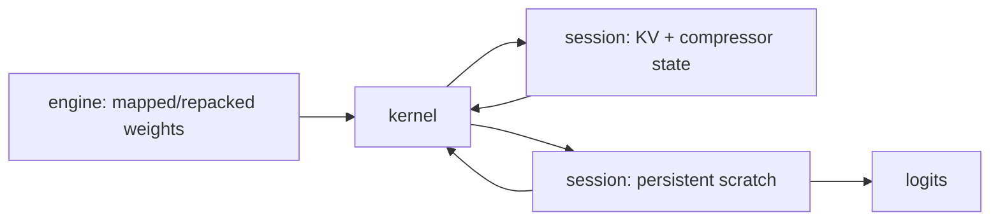

# 5. GPU implementation

[Previous](04-numerics.md) · [Index](README.md) · [Next](06-system-optimization.md)

GPU speed comes from arranging dependencies, storage, and work—not translating
each CPU loop into a kernel.

## Lifetimes and allocation

Weights live for the engine. KV and graph workspaces live for a session.
Per-layer views and selected-expert tables are reused. Token-local activations
should reuse preallocated buffers. `ds4_alloc_guard_begin/end` detects accidental
host allocation inside guarded inference phases; GPU graph allocation occurs in
session creation. Stable addresses are also prerequisites for graph replay.

## Decode versus prefill dispatch

MMVQ means quantized matrix-vector work: decode-friendly, low row count, often
bandwidth/launch limited. MMQ means quantized matrix-matrix work: prefill or a
multi-session batch, with weight reuse and Tensor Core opportunities. The
vendored definitions live under `cuda/mmq/`; `cuda_use_mmq` and
`cuda_use_mxfp4_mmq` gate the paths. MXFP4 has no generic dequant+cuBLAS fallback
in this code, so MMQ availability is a correctness requirement for its CUDA
prefill path.

Fallbacks matter:

- optional fused QKV/KV-store/attention wrappers return unavailable and the
  graph composes established operations;
- Q8/F16 dense work may dequantize then call cuBLAS;
- MXFP4 routes through vendored MMVQ/MMQ; unsupported layout fails explicitly;
- CPU is a diagnostic reference, not a silent GPU serving fallback.

## Kernel reasoning

Coalesce adjacent lanes across contiguous quant blocks or output columns. Tile
to reuse activations and weight scales. Shared memory saves global reads but can
reduce resident blocks; registers save instructions but spilling is disastrous.
Occupancy is a constraint, not a goal: a lower-occupancy kernel with greater
reuse can win. Inspect registers, shared bytes, achieved occupancy, memory
transactions, and warp stalls together.

Fusion removes intermediate traffic and launches, but lengthens live ranges and
couples shape assumptions. Preserve an unfused differential oracle until the
fused path is proven at short, boundary, and long contexts.

## CUDA Graphs

`ds4_gpu_decode_graph_begin/end` caches decode “islands” by a 48-byte key and
replays them at stable addresses. Separate explicit graphs cover split attention
and routed-MoE paths. Graphs reduce CPU launch overhead; they do not reduce
weight bytes or make dynamic expert identities static. Cache keys and invalidation
must include every shape/address-affecting condition. See [`CUDA graph capture`](https://github.com/antirez/ds4/blob/c1d4597a80e300b803dc642519718f2c999589da/ds4_cuda.cu#L839).

## Check and experiment

Profile one-token decode and 256-token prefill. Expected: decode shows many
small/bandwidth-sensitive launches; prefill moves toward GEMM utilization. Sweep
block size for one quant dot kernel. Expected: performance is non-monotonic as
register/shared pressure trades against occupancy and reuse. Confirm output
against the scalar test at every point.

