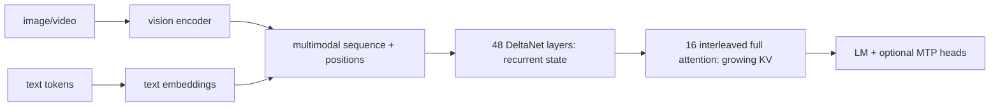

# 10. Transfer study: full multimodal Qwen3.8-27B

[Previous](09-engine-comparison.md) · [Index](README.md) · [Next](11-glossary-worksheets.md)

This is a conceptual porting study, not a proposal to add Qwen support to
DwarfStar. `signalnine/q27`, where available externally, is a comparative case
study only; none of its results are evidence for this checkout.

## Official architecture

**External:** the pinned [Qwen3.8-27B model
card](https://huggingface.co/Qwen/Qwen3.8-27B/blob/1d4bf0f2ff6012fd82039f2fa52739d0dd7c60c0/README.md)
and [configuration](https://huggingface.co/Qwen/Qwen3.8-27B/blob/1d4bf0f2ff6012fd82039f2fa52739d0dd7c60c0/config.json)
describe a dense 27B causal vision-language model: width 5,120, vocabulary
248,320, 64 layers arranged as 16 repetitions of three Gated DeltaNet+FFN
layers and one gated full-attention+FFN layer. Thus there are 48 linear-attention
and 16 full-attention layers. Every layer has a dense 17,408-wide FFN.

DeltaNet uses 16 QK heads and 48 value heads of dimension 128. Full attention
uses 24 query and 4 KV heads of dimension 256 with 64 rotary dimensions. Native
context is 262,144; the card describes extension to 1M. MTP is trained with
multiple steps; the config exposes one MTP hidden layer.

The vision encoder has 27 layers, width 1,152, 16 heads, patch size 16, temporal
patch size 2 and spatial merge size 2, projecting to text width 5,120. Image and
video boundary tokens and multimodal RoPE sections must be produced by the
official processor/template. Text-only tokenization is insufficient for full
model support.

## State is hybrid

DeltaNet state is recurrent and fixed with respect to context length (plus its
short convolution state); full-attention KV grows per token. Prefix persistence
must serialize both and preserve multimodal positions. Replaying only KV or
using DwarfStar’s compressor schema would be wrong.

## Transfer matrix

| DwarfStar idea | Transfer | Reason |
|---|---|---|
| engine/session separation and allocation guard | direct | stable weights/state/scratch lifetimes remain useful |
| CPU/official-output differential oracles | direct | architecture changes, method does not |
| decode MMV vs prefill MMQ dispatch | direct | all dense projections have the same row-count split |
| CUDA Graph decode islands | direct with new keys | hybrid state addresses/shapes and modality enter invariants |
| asymmetric quantization + calibration | direct principle | protect DeltaNet recurrence, norms, vision/projector, embeddings/output as evidence dictates |
| prefix/KV disk checkpoints | redesign | serialize recurrent, convolution, KV, MTP and multimodal position state |
| compressed raw+summary attention cache | not direct | Qwen already defines recurrent DeltaNet plus ordinary attention; invented compression changes the model |
| sparse indexer/top-k positions | not direct | no trained DwarfStar indexer exists in Qwen |
| routed-expert streaming/hotlist | does not apply | Qwen FFNs are dense, so every FFN weight is needed every token |
| expert/tensor sharding policy | redesign | shard dense FFN/attention/DeltaNet matrices, not selected experts |
| DSpark verification machinery | conceptual | MTP proposal/verification and state commit apply, but heads/training semantics differ |
| mHC kernels | does not apply | Qwen has no DwarfStar four-stream mHC layout |

## A plausible single-5090 execution plan

Start text-only for kernel validation but retain an explicit boundary that later
accepts processor-generated visual embeddings and mRoPE positions. Inventory a
quality-validated 4-bit/FP8 mixed checkpoint. Keep recurrent state paths at high
precision initially. Implement dense FFN and attention MMV/MMQ, then DeltaNet
scan/decode with a scalar oracle. Add full-attention KV, hybrid layer scheduler,
and output head. Only then capture graphs, quantize sensitive paths, add vision,
and evaluate MTP. A 32 GB fit must be demonstrated by allocation logs; Chapter 8
shows why nominal bits/weight are insufficient.

## Check and capstone prompt

Design the state record after 10K text tokens plus one image. Expected fields:
token/visual embedding identity or reproducible inputs, multimodal positions,
48 layers of recurrent+conv state, 16 layers of KV, logits/sampler boundary,
model/config hashes, and MTP state if committed. Explain why DwarfStar expert
streaming cannot save Qwen dense-FFN bandwidth.

