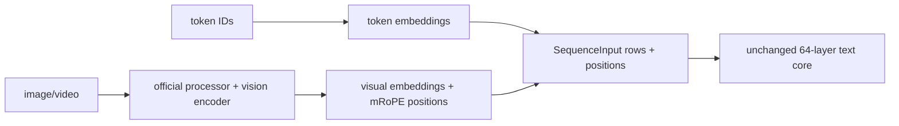

# 10. Deferred extensions: MTP, then vision

[Previous](09-engine-comparison.md) · [Index](README.md) · [Next](11-glossary-worksheets.md)

## Why this matters

V1 is correct text inference. Its interfaces should admit later embeddings and
positions, but speculative decoding and vision must not complicate the first
runnable path or silently become requirements.

## MTP as a separate state machine

**Speculative decoding** separates a cheap proposer from the trusted target.
The proposer guesses several next tokens; the target evaluates them and decides
how many are valid. “Acceptance” means committing the target's state for a
prefix of those guesses, not merely displaying their text. The config exposes one MTP hidden layer. Implement it only after the target text
model passes all gates. MTP proposes a sequence; the target model verifies it;
only the accepted prefix commits. Keep draft/MTP KV and transient hidden state
separate from target `SessionState` until acceptance.

```text
snapshot target frontier
draft candidates c0..cn
target verifies candidates in one or more rows
accept k: commit target state through c[k-1], commit matching MTP state
reject suffix: discard its target/MTP speculative state
```

Test full acceptance, partial acceptance, and zero acceptance, including stop
tokens and stochastic sampling semantics. Each result must equal a non-speculative
target run under the selected sampler. DwarfStar's DSpark supplies useful
commit/rollback ideas, but its tensors and proposal rules are not Qwen MTP.

## Vision boundary and mRoPE

`SequenceInput` already accepts embeddings `[T,5120]` and position metadata, so
the text core does not need to know whether a row came from token lookup or the
visual projector. A separate official-compatible processor later performs
image/video token placement and produces temporal, height, and width positions.

The official vision contract is 27 layers, width 1,152, 16 heads, FFN 4,304,
patch 16, temporal patch 2, spatial merge 2, and projection to 5,120. The text
RoPE uses three mRoPE sections `[11,11,10]`, interleaved into the 64 rotary
dimensions. Image/video boundary IDs and processor ordering come from pinned
processor files, never handwritten assumptions.



Vision acceptance covers text-only regression, one image and one video, visual
row placement, position tensors, embedding splice, logits versus Transformers,
and save/restore with multimodal position metadata. Vision tokens consume the
same attention KV budget as text positions.

## Transfer boundary and failure modes

Reuse DwarfStar's speculative transactional discipline and session versioning.
Adapt both to Qwen MTP and multimodal positions. Reject DSpark weights/semantics
and any assumption that plain text tokenization represents visual input.

Failures include committing all proposals before verification, sharing MTP and
target KV, rolling back KV but not GDN state, flattening mRoPE to one position,
or embedding vision logic inside CUDA text kernels.

## Exercise and expected result

Draw state after partial acceptance of five proposals and after a prefix with
one image. Expected: target and MTP frontiers commit only the accepted prefix;
the multimodal checkpoint contains reproducible visual input/embedding identity,
mRoPE positions, all GDN state, all full-attention KV, and version hashes.
